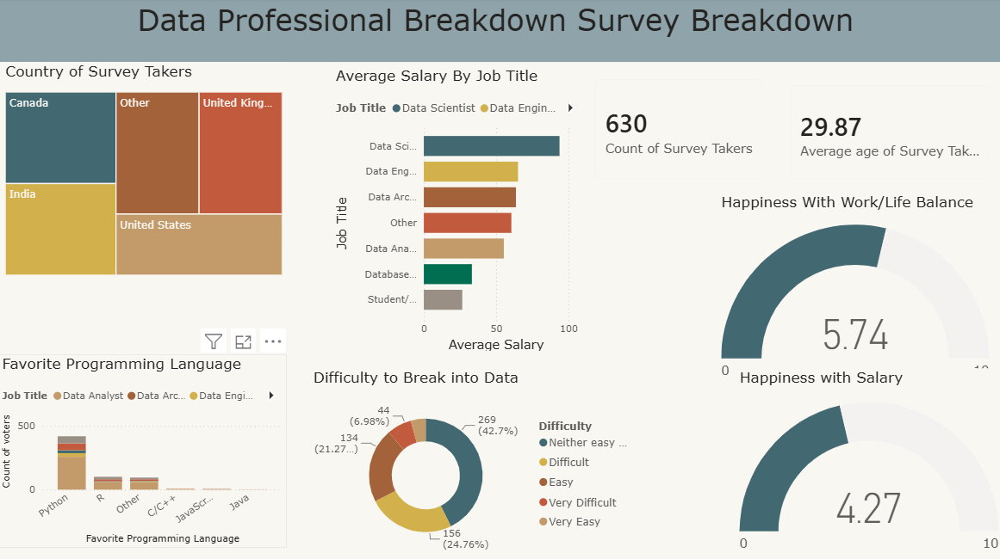

# Data Professional Survey Breakdown Dashboard

An interactive Power BI dashboard analyzing survey data from data professionals worldwide, focusing on salary benchmarks, tech stacks, and key demographic trends.

## Dashboard Preview

## Key Features & Data Pipeline
- **Data Cleaning & Transformation:** Cleansed and standardized raw text/salary fields using **Power Query** (handled missing data, normalized currency values, and split strings).
- **Interactive Visualizations:** Built KPI cards, bar charts, and treemaps using **DAX** measures to evaluate average salary by job title and favorite programming languages.
- **Dynamic Cross-Filtering:** Enabled multi-variable filtering for rapid drill-down analysis across locations and job roles.
